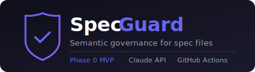

<div align="center">



<br/>
<br/>

[](LICENSE)
[]()
[](https://github.com/github/spec-kit)

</div>

---

SpecGuard is a semantic governance layer for spec files. It classifies every PR change against your locked project goal and scope — passing additive changes silently, warning on low-confidence shifts, and blocking unapproved direction changes at merge time.

---

## The Problem

In repos where AI agents and humans both contribute, a PR can look perfectly fine on the surface while silently shifting the project's direction. SpecGuard catches that — not by checking who made the change, but by understanding what the change means against your locked goal and scope.

```
PR:         "refactored README for clarity"
Change:      Added a full SaaS pricing section
             to a project scoped as a local CLI tool.

SpecGuard:   ❌  SCOPE CHANGE — 94% confidence
                 "SaaS pricing" is out of scope
                 requires approval from @architect
```

---

## How It Works

Lock your goal and scope in `.specguard/lock.json`. SpecGuard does the rest on every PR.

```
PR opened
 ├─ Not a watched file ───────────────────── ✅ Pass
 ├─ Protected path, wrong author ──────────── ❌ Block  (no AI involved)
 └─ Watched spec file changed
      └─ Claude classifies the diff
           ├─ ADDITIVE ───────────────────── ✅ Pass   (silent)
           ├─ SCOPE CHANGE, low confidence ── ⚠️  Warn
           └─ SCOPE CHANGE, high confidence ── ❌ Block  (until authorized approval)
```

Approving via GitHub's normal review flow re-evaluates the check automatically — no new commits needed.

---

## Quickstart

**1.** Create `.specguard/lock.json`

```json
{
  "goal": "A CLI tool that converts Markdown to PDF",
  "scope_in":  ["Markdown parsing", "PDF rendering", "CLI flags"],
  "scope_out": ["GUI", "cloud sync", "collaboration features"]
}
```

**2.** Add the workflow

```yaml
# .github/workflows/specguard.yml
name: specguard
on: [pull_request, pull_request_review]   # the review trigger re-evaluates approvals
permissions:
  contents: read
  pull-requests: read
jobs:
  specguard:
    runs-on: ubuntu-latest
    steps:
      - uses: actions/checkout@v4
        with: {fetch-depth: 0}             # required: base...head history
      - uses: Sawaiz-zip/spec-guard@v0
        with:
          anthropic-api-key: ${{ secrets.ANTHROPIC_API_KEY }}
```

**3.** Set `ANTHROPIC_API_KEY` as a repo secret, then require the `specguard` check under branch protection.

That's it for solo use — scope changes now warn on every PR. To make them *block* until an authorized teammate approves, add roles:

```yaml
# .specguard/roles.yml  (optional — presence switches warn mode to enforce mode)
roles:
  architect: [your-github-username]
rules:
  ".specguard/**":          # nobody outside the role may touch the lock itself
    edit: architect
  "README.md":              # who can approve scope changes per file
    scope_changes: {approve: architect}
```

```yaml
# .specguard/config.yml  (optional — these are the defaults)
watch: ["README.md", "CLAUDE.md", "AGENTS.md", "ARCHITECTURE.md", "*.kilo", ".specguard/**"]
block_threshold: 0.75
on_error: warn              # vendor outage: pass with a loud warning ("fail" to block)
model: claude-opus-4-8
max_diff_chars: 30000
```

> You bring your own API key and choose the model — SpecGuard never bills you directly.
> Set `model:` in `.specguard/config.yml` to use any model you have access to.
> With the default model expect roughly **$0.03–0.05 per watched file per push**
> (~3–5K input + ~500 output tokens); lighter models cost proportionally less.

<!-- TODO: blocked-PR screenshot from the sandbox E2E run (T037) -->
<!--  -->

---

## Roadmap

| Phase | Status | What ships |
|:---:|:---:|:---|
| **0 — CI Gate** | 🔴 Building | GitHub Action · scope classification · role-based approval · branch protection |
| **1 — Local Tools** | ⚪ Planned | CLI (`specguard init`, `specguard check`) · pre-commit hook · MCP server |
| **2 — GitHub App** | ⚪ Planned | Native Checks API · fork PR support · bot vs human identity · Spec Kit adapter |
| **3 — Advanced** | ⚪ Planned | Section-level locking · monorepo support · multi-provider classifier |

---

## Principles

No false blocks. No new UI. No dashboards.

The only enforceable boundary is merge time — everything else is advisory. A wrong Friday block means uninstall by Monday, so additive changes always pass silently. Hard blocks are deterministic (no AI). Probabilistic verdicts always show their confidence and never block without explanation.

Full constitution: [`.specify/memory/constitution.md`](.specify/memory/constitution.md)

---

<div align="center">

Built with [Spec Kit](https://github.com/github/spec-kit) · Powered by Claude · MIT License

</div>
