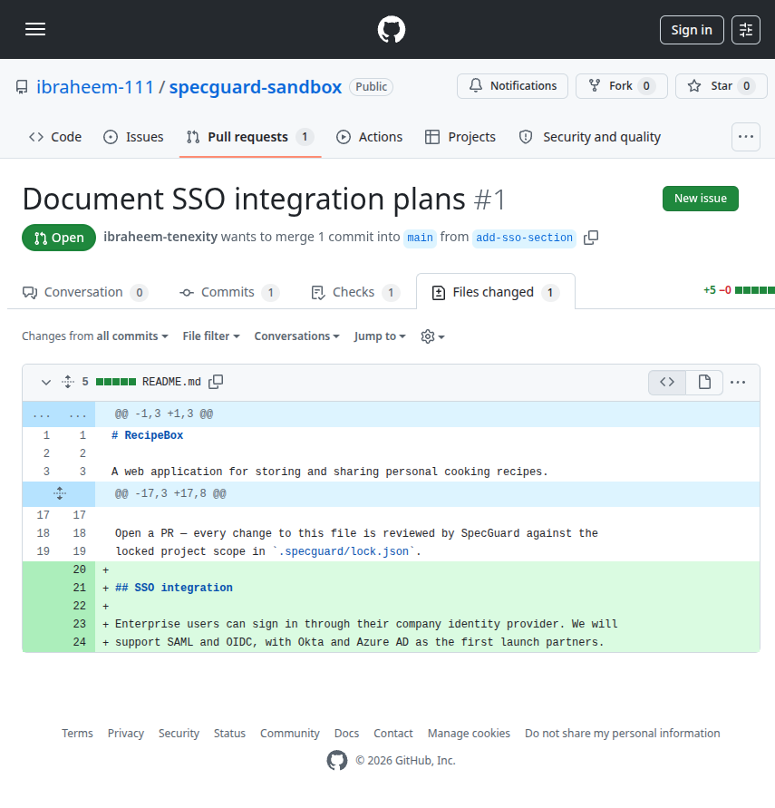
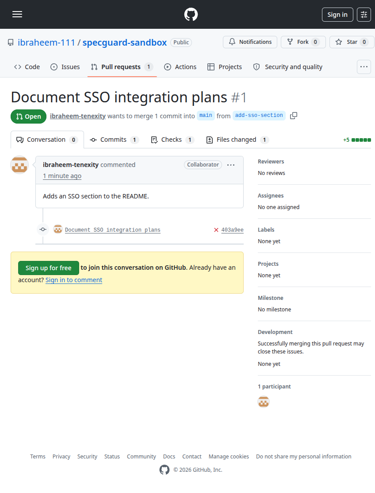

<div align="center">


<br/>
<br/>

[](LICENSE)
[]()
[](https://github.com/github/spec-kit)

</div>

---

SpecGuard is a semantic governance layer for spec files. It classifies every PR change against your locked project goal and scope — passing additive changes silently, warning on low-confidence shifts, and blocking unapproved direction changes at merge time.

---

## The Problem

In repos where AI agents and humans both contribute, a PR can look perfectly fine on the surface while silently shifting the project's direction. SpecGuard catches that — not by checking who made the change, but by understanding what the change means against your locked goal and scope.

```
PR:         "refactored README for clarity"
Change:      Added a full SaaS pricing section
             to a project scoped as a local CLI tool.

SpecGuard:   ❌  SCOPE CHANGE — 94% confidence
                 "SaaS pricing" is out of scope
                 requires approval from @architect
```

---

## How It Works

Lock your goal and scope in `.specguard/lock.json`. SpecGuard does the rest on every PR.

```
PR opened
 ├─ Not a watched file ───────────────────── ✅ Pass
 ├─ Protected path, wrong author ──────────── ❌ Block  (no AI involved)
 └─ Watched spec file changed
      └─ Claude classifies the diff
           ├─ ADDITIVE ───────────────────── ✅ Pass   (silent)
           ├─ SCOPE CHANGE, low confidence ── ⚠️  Warn
           └─ SCOPE CHANGE, high confidence ── ❌ Block  (until authorized approval)
```

Approving via GitHub's normal review flow re-evaluates the check automatically — no new commits needed.

---

## Quickstart

**1.** Create `.specguard/lock.json`

```json
{
  "goal": "A CLI tool that converts Markdown to PDF",
  "scope_in":  ["Markdown parsing", "PDF rendering", "CLI flags"],
  "scope_out": ["GUI", "cloud sync", "collaboration features"]
}
```

**2.** Add the workflow

```yaml
# .github/workflows/specguard.yml
name: specguard
on:
  pull_request:
  pull_request_review:
    types: [submitted]
permissions:
  contents: read
  pull-requests: read
jobs:
  specguard:                               # the required branch-protection check
    if: github.event_name == 'pull_request'
    runs-on: ubuntu-latest
    steps:
      - uses: actions/checkout@v4
        with: {fetch-depth: 0}             # required: base...head history
      - uses: Sawaiz-zip/spec-guard@v0
        with:
          anthropic-api-key: ${{ secrets.ANTHROPIC_API_KEY }}
  reevaluate:                              # an approval re-runs the check in place
    if: github.event_name == 'pull_request_review' && github.event.review.state == 'approved'
    runs-on: ubuntu-latest
    permissions: {actions: write}
    steps:
      - env:
          GH_TOKEN: ${{ github.token }}
        run: |
          run_id=$(gh api "repos/${{ github.repository }}/actions/workflows/specguard.yml/runs?event=pull_request&head_sha=${{ github.event.pull_request.head.sha }}" --jq '.workflow_runs[0].id // empty')
          [ -n "$run_id" ] && gh api -X POST "repos/${{ github.repository }}/actions/runs/$run_id/rerun"
```

**3.** Set `ANTHROPIC_API_KEY` as a repo secret, then require the `specguard` check under branch protection.

That's it for solo use — scope changes now warn on every PR. To make them *block* until an authorized teammate approves, add roles:

```yaml
# .specguard/roles.yml  (optional — presence switches warn mode to enforce mode)
roles:
  architect: [your-github-username]
rules:
  ".specguard/**":          # nobody outside the role may touch the lock itself
    edit: architect
  "README.md":              # who can approve scope changes per file
    scope_changes: {approve: architect}
```

```yaml
# .specguard/config.yml  (optional — these are the defaults)
watch: ["README.md", "CLAUDE.md", "AGENTS.md", "ARCHITECTURE.md", "*.kilo", ".specguard/**"]
block_threshold: 0.75
on_error: warn              # vendor outage: pass with a loud warning ("fail" to block)
model: claude-sonnet-4-6
max_diff_chars: 30000
```

> You bring your own API key and choose the model — SpecGuard never bills you directly.
> Set `model:` in `.specguard/config.yml` to use any model you have access to.
> With the default `claude-sonnet-4-6` expect roughly **$0.01–0.02 per watched file
> per push** (~3–5K input + ~500 output tokens); it scored a perfect confusion
> matrix on the calibration corpus. Note: `claude-opus-4-8` is hard-blocked by a
> project guardrail (no quality gain on this task at ~6× the cost).




---

## Local Tools

Everything the merge gate decides, you can preview on your machine — same engine, same
verdicts, advisory only.

```bash
pip install specguard-ci

specguard init     # guided setup: goal, scope, optional roles/workflow/hook
specguard check    # what would the gate say about my working tree?
specguard check --staged          # ...about what I'm committing?
specguard check --base origin/main  # ...about this branch as a PR?
```

**Pre-commit warnings** (never blocks a commit — enforcement stays at merge time):

```yaml
# .pre-commit-config.yaml
repos:
  - repo: https://github.com/Sawaiz-zip/spec-guard
    rev: v0.2.0
    hooks: [{id: specguard-check}]
```

**Warn coding agents at write time** — the MCP server lets agents like Claude Code check
a drafted spec change *before* writing it:

```bash
pip install "specguard-ci[mcp]"
```

```json
// e.g. .mcp.json for Claude Code
{ "mcpServers": { "specguard": { "command": "specguard", "args": ["mcp"] } } }
```

Agents get three tools: `check_proposed_change` (full verdict for proposed content),
`get_scope_lock`, and `list_watched_paths`. Drift prevention moves from "blocked PR" to
"agent self-corrects mid-draft."

> Local results always carry an advisory notice: nothing local enforces. Governance
> config is read from your committed baseline — editing your own lock locally doesn't
> change the verdict your PR will actually get.

---

## Roadmap

| Phase | Status | What ships |
|:---:|:---:|:---|
| **0 — CI Gate** | 🟢 Shipped | GitHub Action · scope classification · role-based approval · branch protection |
| **1 — Local Tools** | 🟢 Shipped | CLI (`specguard init`, `specguard check`) · pre-commit hook · MCP server |
| **2 — GitHub App** | ⚪ Planned | Native Checks API · fork PR support · bot vs human identity · Spec Kit adapter |
| **3 — Advanced** | ⚪ Planned | Section-level locking · monorepo support · multi-provider classifier |

---

## Principles

No false blocks. No new UI. No dashboards.

The only enforceable boundary is merge time — everything else is advisory. A wrong Friday block means uninstall by Monday, so additive changes always pass silently. Hard blocks are deterministic (no AI). Probabilistic verdicts always show their confidence and never block without explanation.

Full constitution: [`.specify/memory/constitution.md`](.specify/memory/constitution.md)

---

<div align="center">

Built with [Spec Kit](https://github.com/github/spec-kit) · Powered by Claude · MIT License

</div>
