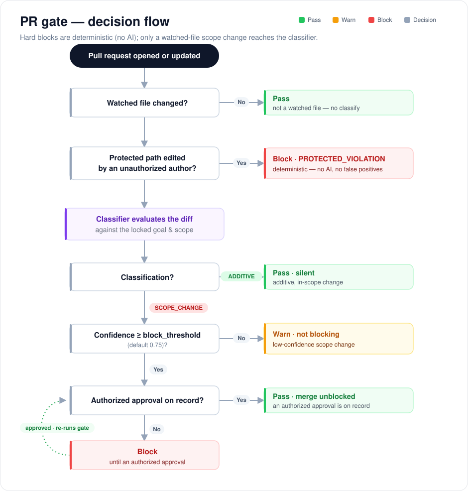

<div align="center">


<br/>
<br/>

[](https://github.com/marketplace/actions/specguard-ci)
[](https://pypi.org/project/specguard-ci/)
[](https://pypi.org/project/specguard-ci/)
[](LICENSE)
[](https://github.com/github/spec-kit)

**Your spec files are the source of truth. SpecGuard keeps them that way.**

In spec-driven development the spec comes first and the code follows it, which makes your spec files the ones that actually steer the project. It also makes them the easiest place for the direction to change without anyone noticing. SpecGuard locks your project's goal and scope, then reads every pull request with a language model that compares the change to what you locked. When a change moves the goal, it tells you in plain words what shifted, who is asking for it, and who is allowed to sign off.

Edits that stay inside the scope pass without a sound. A real direction change gets explained, and if you want, held at merge time until the right person approves.

</div>

---

## Contents

- [The problem](#the-problem)
- [How it works](#how-it-works)
- [Install](#install)
- [Quick start](#quick-start)
- [The three ways to run it](#the-three-ways-to-run-it)
- [Setting up the merge gate](#setting-up-the-merge-gate)
- [Configuration files](#configuration-files)
- [Command reference](#command-reference)
- [Approving a scope change](#approving-a-scope-change)
- [Choosing a provider](#choosing-a-provider)
- [Advanced governance](#advanced-governance)
- [Reuse the specs you already have](#reuse-the-specs-you-already-have)
- [How this project was built](#how-this-project-was-built)
- [Status](#status)

---

## The problem

Most review tooling looks at who touched which files. That misses the change that tends to cause the most trouble in a repo where people and AI agents both contribute: the small, sensible looking edit that shifts the project's direction without anyone deciding to.

Say you maintain a local-first notes app. The spec is clear that notes live in plain files on the user's own machine, and that accounts and cloud sync are out of scope. One afternoon a pull request titled "improve the onboarding docs" adds a short section:

```diff
+ ## Syncing across devices
+ Sign in with your account and your notes stay in sync through our hosted service.
```

The title is fair. The diff is four lines. But the project just grew a login system and a backend, and nobody chose that on purpose.

SpecGuard is built for that case. It does not check who opened the pull request. It reads what the change means against the goal and scope you locked, and treats a direction change differently from a typo.

<div align="center">

</div>

## How it works

You write the project's goal and scope down once. SpecGuard keeps its copy at the last trusted commit, so a pull request can never quietly edit the rules it is judged by. On every pull request it walks a short path:

1. A file you do not govern changed. Nothing happens.
2. A protected file changed and the author is not in the role allowed to touch it. Blocked, with no model involved. This one is a plain rule, so it cannot be a false positive.
3. A governed spec file changed. A language model compares the diff to your locked scope and returns one of two answers with a confidence score:
   - **Additive.** The change stays inside the scope. It passes quietly.
   - **Scope change.** The change moves the goal or introduces something you marked out of scope. If the model is confident, the merge is held until an authorized approval exists. If it is unsure, you get a warning instead of a block.

Two answers from the model, one deterministic rule, and a confidence line so a probabilistic decision never hides how sure it was. Merge time is the only place SpecGuard actually holds anything. Everything before it is there to warn you early, and it stays out of the way when a change is fine.

## Install

```bash
pip install specguard-ci
```

That gives you the `specguard` command and the classifier engine. Provider backends and the agent server are optional extras:

```bash
pip install "specguard-ci[openai]"    # OpenAI or OpenRouter
pip install "specguard-ci[gemini]"    # Google Gemini
pip install "specguard-ci[mcp]"       # the MCP server for coding agents
```

SpecGuard needs Python 3.10 or newer. The GitHub Action installs its own Python on the runner, so the gate itself works for a repo in any language.

## Quick start

The fastest path is the guided setup:

```bash
specguard init
```

It asks for your goal and scope, then offers to write the optional files (roles, the CI workflow, a pre-commit hook, section locking). Every file it writes is commented, so you can read what each setting does without leaving the file.

If you would rather do it by hand, there are two steps.

**1. Write `.specguard/lock.json`.**

```json
{
  "goal": "A local-first notes app that stores notes as plain Markdown files on the user's machine",
  "scope_in": ["creating and editing notes", "full-text search", "tags and backlinks", "export to HTML or PDF"],
  "scope_out": ["accounts or login", "syncing to a hosted server", "a mobile app", "usage tracking"]
}
```

**2. Add the workflow at `.github/workflows/specguard.yml`.**

```yaml
name: specguard
on:
  pull_request:
permissions:
  contents: read
  pull-requests: read
jobs:
  specguard:
    runs-on: ubuntu-latest
    steps:
      - uses: actions/checkout@v4
        with: { fetch-depth: 0 }        # SpecGuard needs the base...head history
      - uses: Sawaiz-zip/spec-guard@v0
        with:
          anthropic-api-key: ${{ secrets.ANTHROPIC_API_KEY }}
```

Add `ANTHROPIC_API_KEY` as a repository secret, then require the `specguard` check under **Settings, Branches, Branch protection**.

At this point scope changes will warn on every pull request. To make them block until an authorized teammate approves, add a [`roles.yml`](#rolesyml). That one file is the switch between advisory and enforcing.

## The three ways to run it

SpecGuard is one engine with three front doors. They all reach the same classifier and produce the same verdict. What differs is when they run and whether they can stop anything.

<div align="center">

</div>

| Surface | When it runs | Can it block? | What it is for |
|---|---|---|---|
| **GitHub Action** | On every pull request | Yes, at merge time | The enforcing layer. This is the only place a change is actually held. |
| **CLI** (`specguard`) | On your machine, on demand | No | Preview what the gate would say before you open the PR. Also the setup and approval commands. |
| **MCP server** | Inside a coding agent | No | Let an agent check a change it is about to write, so drift never reaches a file. |

The two local surfaces are advisory on purpose. A pre-commit hook that blocks the commit is a hook people quietly delete, so the hook only warns. The rule is simple: warn early and often, enforce in exactly one place.

## Setting up the merge gate

The merge gate is the part that matters. Here is the full picture.

**The workflow.** The short version in [Quick start](#quick-start) runs the check on each pull request. If you also want approvals to re-run the check without a new commit, and you want the `/specguard approve` comment to work, use the fuller workflow:

```yaml
name: specguard
on:
  pull_request:
  pull_request_review:
    types: [submitted]
  issue_comment:                          # enables the /specguard approve comment
    types: [created]
permissions:
  contents: read
  pull-requests: read
jobs:
  specguard:                              # the required branch-protection check
    if: github.event_name == 'pull_request'
    runs-on: ubuntu-latest
    steps:
      - uses: actions/checkout@v4
        with: { fetch-depth: 0 }
      - uses: Sawaiz-zip/spec-guard@v0
        with:
          anthropic-api-key: ${{ secrets.ANTHROPIC_API_KEY }}

  reevaluate:                             # an approving review re-runs the check in place
    if: github.event_name == 'pull_request_review' && github.event.review.state == 'approved'
    runs-on: ubuntu-latest
    permissions: { actions: write }
    steps:
      - env: { GH_TOKEN: '${{ github.token }}' }
        run: |
          run_id=$(gh api "repos/${{ github.repository }}/actions/workflows/specguard.yml/runs?event=pull_request&head_sha=${{ github.event.pull_request.head.sha }}" --jq '.workflow_runs[0].id // empty')
          [ -n "$run_id" ] && gh api -X POST "repos/${{ github.repository }}/actions/runs/$run_id/rerun"

  comment-approve:                        # /specguard approve re-runs the check
    if: github.event_name == 'issue_comment' && github.event.issue.pull_request && startsWith(github.event.comment.body, '/specguard approve')
    runs-on: ubuntu-latest
    permissions: { actions: write, pull-requests: read }
    steps:
      - env: { GH_TOKEN: '${{ github.token }}' }
        run: |
          head_sha=$(gh api "repos/${{ github.repository }}/pulls/${{ github.event.issue.number }}" --jq '.head.sha')
          run_id=$(gh api "repos/${{ github.repository }}/actions/workflows/specguard.yml/runs?event=pull_request&head_sha=$head_sha" --jq '.workflow_runs[0].id // empty')
          [ -n "$run_id" ] && gh api -X POST "repos/${{ github.repository }}/actions/runs/$run_id/rerun"
```

**The secret.** SpecGuard uses your own API key and never bills you. With the default model, budget somewhere around one to two cents per watched file per push. The key lives as a repository secret and is masked in the logs.

**Branch protection.** Require the `specguard` check on your default branch. Until that box is ticked, the check reports its verdict but the merge button is not actually held.

**A note on other providers.** The Marketplace Action passes an Anthropic key, so it runs Anthropic out of the box. To use OpenAI, Gemini, or OpenRouter in CI, skip the composite action and run the module directly with the matching environment variable:

```yaml
      - uses: actions/setup-python@v5
        with: { python-version: "3.12" }
      - run: pip install "specguard-ci[openai]"
      - run: python -m specguard.ci
        env:
          OPENROUTER_API_KEY: ${{ secrets.OPENROUTER_API_KEY }}
          GITHUB_TOKEN: ${{ github.token }}
```

Set `provider` and `model` in `config.yml` to match. That is exactly how this repository runs its own gate.

## Configuration files

Everything lives under `.specguard/`. Only `lock.json` is required. The rest are optional and have sensible defaults, so you can add them as you need them. The files below are complete and commented, so you can copy one in and edit from there.

### `lock.json`

The one required file. It is the goal and the boundary that every change is measured against. JSON has no comments, so the fields are described underneath.

```json
{
  "goal": "A local-first notes app that stores notes as plain Markdown files on the user's machine",
  "scope_in": [
    "creating, editing, and organizing notes",
    "full-text search across a user's own notes",
    "tags and backlinks between notes",
    "export to HTML or PDF"
  ],
  "scope_out": [
    "accounts, login, or authentication",
    "syncing notes to a hosted server",
    "a mobile or web app",
    "usage tracking or telemetry"
  ]
}
```

| Field | Required | What it does |
|---|---|---|
| `goal` | yes | One sentence describing what the project is. This is the anchor every change is compared against. |
| `scope_in` | no | Topics that legitimately belong. Edits that elaborate these read as additive. Leave it empty and the goal alone carries the judgment. |
| `scope_out` | no | The explicit "not this project" list. Introducing any of these is a scope change. Naming a boundary is what makes a block precise instead of a guess, so this is the list worth spending time on. |

The file is checked in and versioned with your code. If your repo already uses Spec Kit or OpenSpec, you can skip it and SpecGuard will derive the same thing from those files. See [Reuse the specs you already have](#reuse-the-specs-you-already-have).

### `config.yml`

Behavior settings, all optional. The version below shows every key commented out, which means it changes nothing on its own. The values shown are the defaults, so uncomment only what you want to change.

```yaml
# .specguard/config.yml
# Every key is optional. Commented out means "use the default shown".

# watch: the files SpecGuard classifies. Anything not matched here is ignored,
# which is why a code-only PR usually sails through untouched. Globs are allowed.
# watch:
#   - "README.md"
#   - "CLAUDE.md"
#   - "AGENTS.md"
#   - "ARCHITECTURE.md"
#   - "docs/**/*.md"
#   - ".specguard/**"

# block_threshold: how confident the model must be to BLOCK a scope change.
# Below this number it warns instead. Raise it for fewer blocks and more
# warnings, lower it to be stricter. Range 0.0 to 1.0.
# block_threshold: 0.75

# on_error: what to do when the provider call fails (outage, rate limit, bad key).
#   warn  (default): let the PR pass with a loud "could not classify" note.
#   fail:            hold the PR until classification succeeds.
# The default fails open on purpose, so a provider having a bad day does not
# become your team having a bad day.
# on_error: warn

# provider: which backend classifies. One of:
#   anthropic (default) | openai | gemini | openrouter
# Anything other than anthropic needs an explicit model below.
# provider: anthropic

# model: the model id to classify with. claude-sonnet-4-6 is the calibrated
# default. claude-opus-4-8 is refused by a built-in guardrail: it costs far more
# with no measured gain on this task.
# model: claude-sonnet-4-6

# max_diff_chars: per-file diff size, in characters, before the diff is
# truncated to keep token cost bounded. Must be greater than 0.
# max_diff_chars: 30000
```

### `roles.yml`

Who is allowed to approve a scope change, and who is allowed to touch the protected files. Adding this file is the switch that turns scope changes from a warning into a block. Without it, SpecGuard advises but never holds anything.

```yaml
# .specguard/roles.yml
# The presence of this file switches the gate from WARN mode into BLOCK mode.

# roles: map a role name to the GitHub usernames in it. Names are yours to choose.
roles:
  architect: [your-gh-username]
  # docs-lead: [alice-gh, ben-gh]        # you can define as many roles as you like

# rules: for a path or glob, who may do what. Two rule kinds exist.
#
#   edit: <role>
#     Only this role may change the path at all. This is a deterministic hard
#     block with no model involved, so it never misfires. Use it to protect the
#     files that define your governance.
#
#   scope_changes: { approve: <role> }
#     When the classifier flags a scope change on this path, only an APPROVED
#     review (or approval) from this role clears the block.
#
# Additive, in-scope changes always pass on their own. There is no rule to write
# for them, and no rule key that would let you add friction to them.
rules:
  ".specguard/**":                        # protect the lock and roles files themselves
    edit: architect
  "README.md":                            # who approves scope changes to the README
    scope_changes: { approve: architect }

  # More examples, uncomment and adapt:
  # "ARCHITECTURE.md":
  #   edit: architect                     # only the architect may edit this file
  # "docs/**":
  #   scope_changes: { approve: docs-lead }
```

A short but important detail: authorization is always recomputed from this file at the trusted base commit, using the approver's real GitHub login. Anyone can trigger a re-run of the check. Only someone genuinely in the named role can clear a block.

### `regions.yml`

Section locking, optional. By default SpecGuard governs a watched file as a whole. This narrows that to named heading regions, so you can lock the parts that define direction and leave the surrounding prose free to edit.

```yaml
# .specguard/regions.yml
# Optional. Restrict governance to named headings in a file. Edits outside every
# listed heading pass without ever reaching the classifier, so this can only
# reduce friction, never add it.
#
# If a listed heading is renamed or removed, the check fails loudly rather than
# leaving the section silently ungoverned. That is deliberate: rename it here on
# purpose so a quiet rename cannot slip a section out from under governance.
files:
  "ARCHITECTURE.md":
    - "Goal"
    - "Out of Scope"
  # "README.md":
  #   - "Project scope"
```

## Command reference

```bash
specguard init      # scaffold .specguard/ and the workflow, interactively
specguard check     # preview the gate's verdict for local changes
specguard approve   # approve a pull request's scope change from the terminal
specguard mcp       # run the MCP server over stdio (needs the [mcp] extra)
```

**`specguard check`** runs the same engine the merge gate does, against local changes. It is advisory and never changes anything.

```bash
specguard check                       # what would the gate say about my working tree?
specguard check --staged              # only what I have staged for commit
specguard check --base origin/main    # this whole branch, the way a PR would see it
specguard check --json                # machine-readable output for scripts
```

| Command | Useful flags | Notes |
|---|---|---|
| `init` | `--yes` non-interactive with a placeholder goal, `--force` overwrite an existing lock | Writes only the files you accept. |
| `check` | `--staged`, `--base <ref>`, `--head <ref>`, `--json`, `--hook` | Governance is read from your committed baseline, so editing your own lock locally does not change the verdict a real PR would get. |
| `approve <pr>` | `--repo owner/name` | Needs `GH_TOKEN` or `GITHUB_TOKEN` with pull-request access. Repo is inferred from your `origin` remote otherwise. |
| `mcp` | none | Speaks the Model Context Protocol over stdio. |

### Pre-commit hook

An advisory warning at commit time. It never blocks the commit, so it cannot train people to bypass it.

```yaml
# .pre-commit-config.yaml
repos:
  - repo: https://github.com/Sawaiz-zip/spec-guard
    rev: v0.4.4
    hooks:
      - id: specguard-check
```

### MCP server

Let a coding agent check a change before it writes it. Drift prevention moves from "the PR got blocked" to "the agent reconsidered mid-draft".

```bash
pip install "specguard-ci[mcp]"
```

```json
// .mcp.json, for example in Claude Code
{ "mcpServers": { "specguard": { "command": "specguard", "args": ["mcp"] } } }
```

The server exposes four tools:

| Tool | What it answers |
|---|---|
| `check_proposed_change` | A full verdict for content the agent is about to write. On a would-be block it returns a redirect naming the approver role, so the agent can propose the change properly instead of just writing it. |
| `check_permission` | Whether a given identity may make a given class of change to a given file. |
| `get_scope_lock` | The active goal and scope. Pass a `path` to get the lock governing that path in a monorepo. |
| `list_watched_paths` | Which paths are governed, and whether enforcement is on. |

## Approving a scope change

When the gate holds a change, one authorized approval clears it. There are three ways to give that approval, and they are all evaluated by the same rule and recorded the same way.

<div align="center">

</div>

| Path | How |
|---|---|
| **Native review** | Someone in the role clicks Approve in the GitHub review UI. |
| **Comment** | Someone in the role comments `/specguard approve` on the pull request. Handy from a phone. |
| **CLI** | `specguard approve <pr-number>` from a terminal, with a token in the environment. |

None of these grant authority by themselves. Each one just re-runs the gate, which recomputes who is allowed from `roles.yml` at the trusted base. A new push after an approval starts blocked again, so a stale approval cannot carry over to code nobody has looked at.

## Choosing a provider

One engine sits behind a provider seam, so you pick the backend you already pay for. Anthropic is included in the base install. The rest are one extra away.

| `provider:` | Install | Key env var | Example `model:` |
|---|---|---|---|
| `anthropic` (default) | `pip install specguard-ci` | `ANTHROPIC_API_KEY` | `claude-sonnet-4-6` |
| `openai` | `pip install "specguard-ci[openai]"` | `OPENAI_API_KEY` | `gpt-4o-2024-11-20` |
| `gemini` | `pip install "specguard-ci[gemini]"` | `GEMINI_API_KEY` | `gemini-2.0-flash` |
| `openrouter` | `pip install "specguard-ci[openai]"` | `OPENROUTER_API_KEY` | `anthropic/claude-3.5-sonnet` |

A word on honesty here. Anthropic with Sonnet 4.6 is the one combination checked against the project's labelled test set, and it passes all of it. The other providers are wired up and tested for plumbing, but they have not been calibrated for classification quality, so treat them as capable but unverified until you run them through `tests/eval/run_eval.py` on your own specs. Providers other than Anthropic need an explicit `model`.

## Advanced governance

### Lock a section, leave the rest free

Govern a single heading region, such as a goal paragraph or an out-of-scope list, while the examples and FAQ around it stay editable. See [`regions.yml`](#regionsyml). Edits outside every declared region never reach the classifier, and a renamed anchor fails loudly rather than un-governing itself quietly.

### One scope per package in a monorepo

Drop a `.specguard/` into a subdirectory and it governs that subtree on its own, with its own goal, scope, roles, and regions.

```text
packages/api/.specguard/lock.json   # "orders API",   out of scope: [billing]
packages/web/.specguard/lock.json   # "marketing site", out of scope: [accounts]
```

A pull request that touches both packages gets two independent verdicts in one run, each judged against its own lock. Each package's `.specguard/` is written as if it were the repo root, so you can copy the whole directory between packages. One thing to know: the list of watched files is read from the repo-root `config.yml`, so make sure its `watch` covers the package paths, for example `packages/**/README.md`.

### Audit export

```bash
SPECGUARD_AUDIT_PATH=audit.json python -m specguard.ci
```

Writes one JSON record per verdict: the file, the scope, the classification and confidence, the required approver roles, and every approval seen on the pull request. It is meant to be uploaded as a workflow artifact. There is no new datastore and no secrets in the output. It is a plain formatting pass over data the gate already computed.

## Reuse the specs you already have

If your repo uses [Spec Kit](https://github.com/github/spec-kit) or [OpenSpec](https://github.com/Fission-AI/OpenSpec), you do not need to hand-write `lock.json`. SpecGuard reads the goal and scope from the files those frameworks already keep, by parsing their public Markdown. It never imports their code.

| Source | Where the goal and scope come from |
|---|---|
| Explicit lock (always wins) | `.specguard/lock.json` |
| Spec Kit | `.specify/memory/constitution.md` plus the touched `specs/<feature>/spec.md` |
| OpenSpec | `openspec/project.md` plus the touched `openspec/changes/<id>/proposal.md` |
| Plain | no framework found, behaves exactly like a hand-written lock |

Selection follows that precedence automatically from your repo layout, and every run reports which source it used. The Spec Kit adapter is exercised on this repository itself. The OpenSpec adapter is built to OpenSpec's documented format but has not been run against a live OpenSpec project, so if your layout differs, pin things down with an explicit `lock.json`.

## How this project was built

SpecGuard was built spec first, with [GitHub Spec Kit](https://github.com/github/spec-kit). Each feature has a spec, a plan, and a task list under [`specs/`](specs/), and the project's constitution lives at [`.specify/memory/constitution.md`](.specify/memory/constitution.md).

It also runs its own gate on itself. Every pull request to this repo is checked by SpecGuard against those same spec files, so a change that drifts from the constitution gets held here just like it would in your repo. If you want to see the tool at work, the specs directory and the commit history are the honest version of the demo.

## Status

| Area | Status | What it covers |
|---|:---:|---|
| CI gate | Shipped | The GitHub Action, scope classification, role-based approval, branch protection. |
| Local tools | Shipped | The CLI (`init`, `check`, `approve`), the pre-commit hook, the MCP server. |
| Provider support | Shipped | Anthropic, OpenAI, Gemini, and OpenRouter behind one engine. Anthropic is the calibrated default. |
| Framework adapters | Shipped | Deriving the lock from Spec Kit or OpenSpec, with an explicit lock as the override. |
| Approval commands | Shipped | The `/specguard approve` comment and the `specguard approve` CLI. |
| Advanced governance | Shipped | Section locking, monorepo multi-scope, audit export. |
| GitHub App | Built, not deployed | An optional companion for public repos that governs fork pull requests, which the Action cannot reach on its own. It is written and tested but not hosted anywhere yet. |

Design notes worth stating plainly: additive changes pass silently, hard blocks are deterministic and involve no model, probabilistic verdicts always show their confidence and never block without a reason, and if the provider is unreachable the default is to warn rather than block. There is no dashboard and no second place to log in. The whole thing lives in your repo and your CI.

More detail lives in [`docs/architecture.md`](docs/architecture.md), [`docs/quickstart.md`](docs/quickstart.md), and [`CHANGELOG.md`](CHANGELOG.md).

<div align="center">

Built with [Spec Kit](https://github.com/github/spec-kit). [MIT License](LICENSE).

</div>
