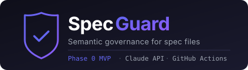

<div align="center">



<br/>
<br/>

[](LICENSE)
[]()
[]()
[]()
[](https://github.com/github/spec-kit)

</div>

---

SpecGuard is a semantic governance layer for spec files. It classifies every PR change against your locked project goal and scope — passing additive changes silently, warning on low-confidence shifts, and blocking unapproved direction changes at merge time.

---

## The Problem

In repos where AI agents and humans both contribute, a PR can look perfectly fine on the surface while silently shifting the project's direction. SpecGuard catches that — not by checking who made the change, but by understanding what the change means against your locked goal and scope.

```
PR:         "refactored README for clarity"
Change:      Added a full SaaS pricing section
             to a project scoped as a local CLI tool.

SpecGuard:   ❌  SCOPE CHANGE — 94% confidence
                 "SaaS pricing" is out of scope
                 requires approval from @architect
```

---

## How It Works

Lock your goal and scope in `.specguard/lock.json` — or, if you use Spec Kit or OpenSpec,
let SpecGuard [derive it from the spec files you already maintain](#govern-the-specs-you-already-have-spec-kit--openspec).
Then it does the rest on every PR.

```
PR opened
 ├─ Not a watched file ───────────────────── ✅ Pass
 ├─ Protected path, wrong author ──────────── ❌ Block  (no AI involved)
 └─ Watched spec file changed
      └─ Claude classifies the diff
           ├─ ADDITIVE ───────────────────── ✅ Pass   (silent)
           ├─ SCOPE CHANGE, low confidence ── ⚠️  Warn
           └─ SCOPE CHANGE, high confidence ── ❌ Block  (until authorized approval)
```

Approving via GitHub's normal review flow re-evaluates the check automatically — no new commits needed.

---

## Quickstart

**1.** Create `.specguard/lock.json`

```json
{
  "goal": "A CLI tool that converts Markdown to PDF",
  "scope_in":  ["Markdown parsing", "PDF rendering", "CLI flags"],
  "scope_out": ["GUI", "cloud sync", "collaboration features"]
}
```

**2.** Add the workflow

```yaml
# .github/workflows/specguard.yml
name: specguard
on:
  pull_request:
  pull_request_review:
    types: [submitted]
  issue_comment:                           # `/specguard approve` comment command
    types: [created]
permissions:
  contents: read
  pull-requests: read
jobs:
  specguard:                               # the required branch-protection check
    if: github.event_name == 'pull_request'
    runs-on: ubuntu-latest
    steps:
      - uses: actions/checkout@v4
        with: {fetch-depth: 0}             # required: base...head history
      - uses: Sawaiz-zip/spec-guard@v0
        with:
          anthropic-api-key: ${{ secrets.ANTHROPIC_API_KEY }}
  reevaluate:                              # an approval re-runs the check in place
    if: github.event_name == 'pull_request_review' && github.event.review.state == 'approved'
    runs-on: ubuntu-latest
    permissions: {actions: write}
    steps:
      - env:
          GH_TOKEN: ${{ github.token }}
        run: |
          run_id=$(gh api "repos/${{ github.repository }}/actions/workflows/specguard.yml/runs?event=pull_request&head_sha=${{ github.event.pull_request.head.sha }}" --jq '.workflow_runs[0].id // empty')
          [ -n "$run_id" ] && gh api -X POST "repos/${{ github.repository }}/actions/runs/$run_id/rerun"
  comment-approve:                         # `/specguard approve` re-runs the check
    # Grants no authority — it only retriggers the gate, which recomputes authorization
    # from roles.yml at the trusted base. Anyone may comment; only a real role member clears a block.
    if: github.event_name == 'issue_comment' && github.event.issue.pull_request && startsWith(github.event.comment.body, '/specguard approve')
    runs-on: ubuntu-latest
    permissions: {actions: write, pull-requests: read}
    steps:
      - env:
          GH_TOKEN: ${{ github.token }}
        run: |
          head_sha=$(gh api "repos/${{ github.repository }}/pulls/${{ github.event.issue.number }}" --jq '.head.sha')
          run_id=$(gh api "repos/${{ github.repository }}/actions/workflows/specguard.yml/runs?event=pull_request&head_sha=$head_sha" --jq '.workflow_runs[0].id // empty')
          [ -n "$run_id" ] && gh api -X POST "repos/${{ github.repository }}/actions/runs/$run_id/rerun"
```

> `specguard init` writes this file for you (including the `/specguard approve` trigger) — the snippet
> above is what you get.

**3.** Set `ANTHROPIC_API_KEY` as a repo secret, then require the `specguard` check under branch protection.

That's it for solo use — scope changes now warn on every PR. To make them *block* until an authorized teammate approves, add roles:

```yaml
# .specguard/roles.yml  (optional — presence switches warn mode to enforce mode)
roles:
  architect: [your-github-username]
rules:
  ".specguard/**":          # nobody outside the role may touch the lock itself
    edit: architect
  "README.md":              # who can approve scope changes per file
    scope_changes: {approve: architect}
```

```yaml
# .specguard/config.yml  (optional — these are the defaults)
watch: ["README.md", "CLAUDE.md", "AGENTS.md", "ARCHITECTURE.md", "*.kilo", ".specguard/**"]
block_threshold: 0.75
on_error: warn              # vendor outage: pass with a loud warning ("fail" to block)
provider: anthropic         # anthropic | openai | gemini | openrouter
model: claude-sonnet-4-6
max_diff_chars: 30000
```

> You bring your own API key and choose the model — SpecGuard never bills you directly.
> With the default `claude-sonnet-4-6` expect roughly **$0.01–0.02 per watched file
> per push** (~3–5K input + ~500 output tokens); it scored a perfect confusion
> matrix on the calibration corpus. `claude-opus-4-8` is hard-blocked by a project
> guardrail (no quality gain on this task at ~6× the cost).

### Choose your LLM provider

SpecGuard classifies through one shared engine behind a provider seam — pick the backend you
already pay for. Anthropic ships in the base install; the rest are one extra away:

| `provider:` | install | API key env var | example `model:` |
|---|---|---|---|
| `anthropic` *(default)* | `pip install specguard-ci` | `ANTHROPIC_API_KEY` | `claude-sonnet-4-6` |
| `openai` | `pip install "specguard-ci[openai]"` | `OPENAI_API_KEY` | `gpt-4o-2024-11-20` |
| `gemini` | `pip install "specguard-ci[gemini]"` | `GEMINI_API_KEY` | `gemini-2.0-flash` |
| `openrouter` | `pip install "specguard-ci[openai]"` | `OPENROUTER_API_KEY` | `anthropic/claude-3.5-sonnet` |

Non-Anthropic providers require an explicit `model:`. Only Anthropic + Sonnet 4.6 is
calibration-verified against the golden corpus; other backends work but are unvalidated until
you run them through `tests/eval/run_eval.py`. `claude-haiku-4-5` is selectable and ~3× cheaper
but missed the 90% recall gate (83%), so it stays opt-in, not the default.

> **Python**: the package installs on **Python 3.10+**. The CI Action provisions its own
> Python on the runner, so the gate works for repos in *any* language; only the local tools
> need a 3.10+ interpreter on your machine.

<!-- TODO: blocked-PR screenshot from the sandbox E2E run (T037) -->
<!--  -->

### Govern the specs you already have (Spec Kit / OpenSpec)

If your repo uses [Spec Kit](https://github.com/github/spec-kit) or
[OpenSpec](https://github.com/Fission-AI/OpenSpec), you don't have to hand-author
`.specguard/lock.json` — SpecGuard reads the goal and scope from the files those
frameworks already maintain (it parses their public markdown; it never imports their code):

| Source | Where the goal/scope comes from |
|---|---|
| **explicit lock** *(always wins)* | `.specguard/lock.json` |
| **Spec Kit** | `.specify/memory/constitution.md` + the touched `specs/<feature>/spec.md` |
| **OpenSpec** | `openspec/project.md` + the touched `openspec/changes/<id>/proposal.md` scope sections |
| **plain** | no framework detected — behaves exactly as before |

Selection is automatic from your repo layout, in that precedence order. Every run reports
which source it used (`Governance source: …` in the CI summary and `specguard check` output),
and an explicit `lock.json` always overrides framework derivation when you need to pin scope by hand.

> The **Spec Kit** adapter is dogfooded on this repository. The **OpenSpec** adapter is built
> against OpenSpec's documented file format but has not yet been validated against a live
> OpenSpec project — if your layout differs, drop in an explicit `.specguard/lock.json` to pin
> the scope.

<!-- TODO: blocked-PR screenshot from the sandbox E2E run (T037) -->
<!--  -->

---

## Local Tools

Everything the merge gate decides, you can preview on your machine — same engine, same
verdicts, advisory only.

```bash
pip install specguard-ci

specguard init     # guided setup: goal, scope, optional roles/workflow/hook
specguard check    # what would the gate say about my working tree?
specguard check --staged          # ...about what I'm committing?
specguard check --base origin/main  # ...about this branch as a PR?
```

**Pre-commit warnings** (never blocks a commit — enforcement stays at merge time):

```yaml
# .pre-commit-config.yaml
repos:
  - repo: https://github.com/Sawaiz-zip/spec-guard
    rev: v0.3.0
    hooks: [{id: specguard-check}]
```

**Warn coding agents at write time** — the MCP server lets agents like Claude Code check
a drafted spec change *before* writing it:

```bash
pip install "specguard-ci[mcp]"
```

```json
// e.g. .mcp.json for Claude Code
{ "mcpServers": { "specguard": { "command": "specguard", "args": ["mcp"] } } }
```

Agents get four tools: `check_proposed_change` (full verdict for proposed content — and, when a
change would block, a `redirect` naming the approver role and suggesting a separate proposal),
`get_scope_lock`, `list_watched_paths`, and `check_permission` (may this identity make this class of
change to this file?). Drift prevention moves from "blocked PR" to "agent self-corrects mid-draft."

> Local results always carry an advisory notice: nothing local enforces. Governance
> config is read from your committed baseline — editing your own lock locally doesn't
> change the verdict your PR will actually get.

---

## Approving a scope change

When the gate blocks a scope change, any **one** authorized approval clears it — three equivalent
paths, all evaluated by the same rule and recorded identically:

| Path | How |
|---|---|
| **Native PR review** | An authorized role member clicks **Approve** in the GitHub review UI. |
| **Comment command** | An authorized member comments `/specguard approve` on the PR (mobile-friendly); the gate re-runs in place. |
| **CLI** | `specguard approve <pr-number>` from the terminal (needs `GH_TOKEN`/`GITHUB_TOKEN`). |

Authorization always uses the **server-side GitHub login** against `roles.yml` — a comment or CLI call
from someone outside the authorizing role does **not** clear the block (anyone can *trigger* a re-run;
only a real role member can *approve*). Merge-time stays the only enforcement layer.

---

## Roadmap

| Phase | Status | What ships |
|:---:|:---:|:---|
| **0 — CI Gate** | 🟢 Shipped | GitHub Action · scope classification · role-based approval · branch protection |
| **1 — Local Tools** | 🟢 Shipped | CLI (`specguard init`, `specguard check`) · pre-commit hook · MCP server |
| **1.5 — Provider-Agnostic** | 🟢 Shipped | Anthropic · OpenAI · Gemini · OpenRouter behind one engine · Python 3.10+ |
| **2 — Framework Adapters** | 🟢 Shipped | Spec Kit + OpenSpec governance overlay — auto-derive the lock from existing specs · explicit-lock override · source reporting |
| **2 — Approval Commands** | 🟢 Shipped | `/specguard approve` PR comment · `specguard approve` CLI · MCP `check_permission` + write-time redirect |
| **2 — GitHub App** | 🟡 Core built | Native Checks API · fork PR support · bot vs human identity (self-hostable; deploy + GitLab pending) |
| **3 — Advanced** | ⚪ Planned | Section-level locking · monorepo support · audit export |

---

## Principles

No false blocks. No new UI. No dashboards.

The only enforceable boundary is merge time — everything else is advisory. A wrong Friday block means uninstall by Monday, so additive changes always pass silently. Hard blocks are deterministic (no AI). Probabilistic verdicts always show their confidence and never block without explanation.

Full constitution: [`.specify/memory/constitution.md`](.specify/memory/constitution.md)

---

<div align="center">

Built with [Spec Kit](https://github.com/github/spec-kit) · Powered by Claude · MIT License

</div>
