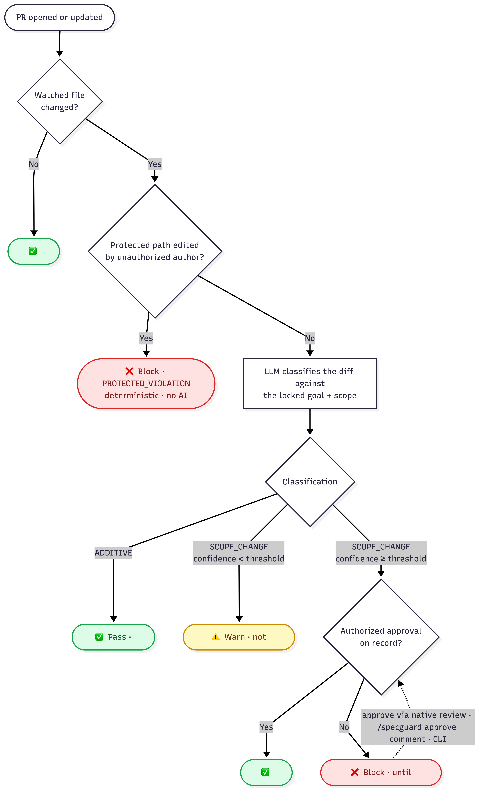
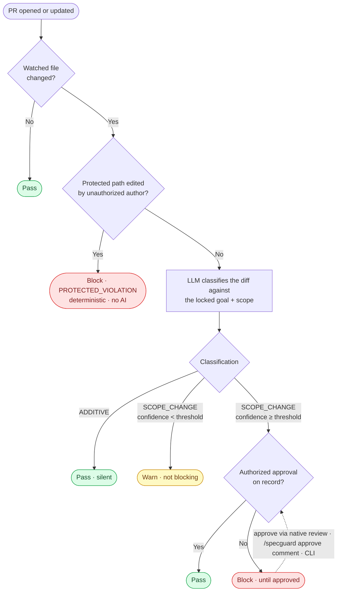
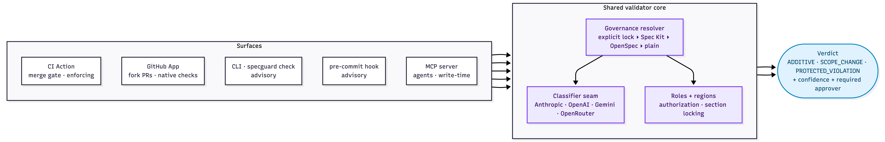
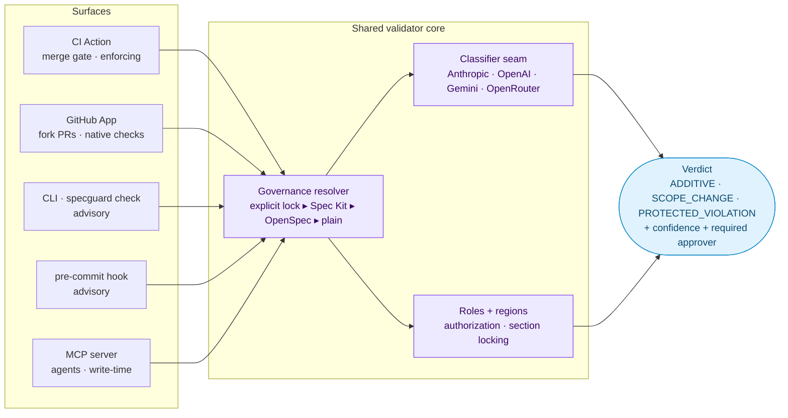
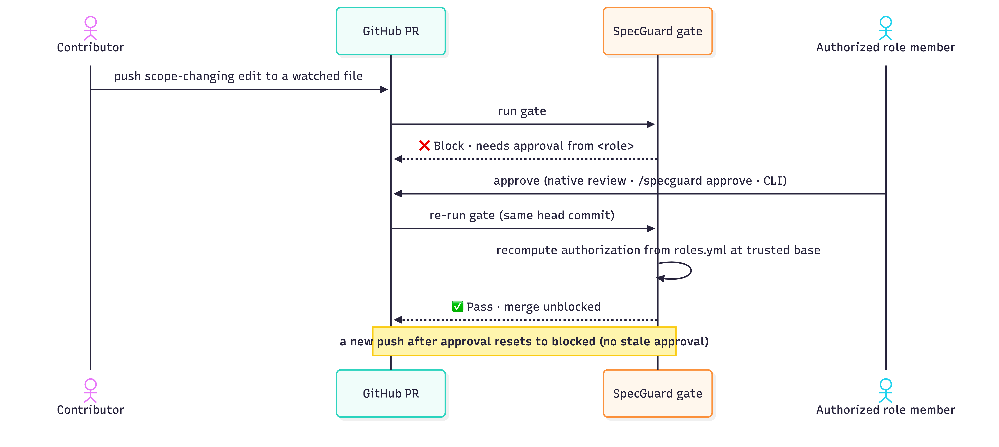
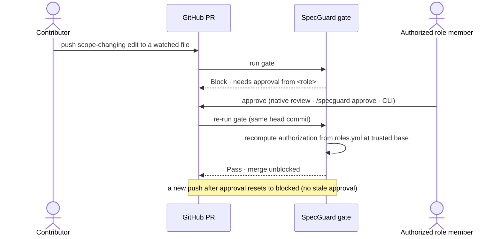

# Architecture & Flow

How SpecGuard turns a pull request into a governance verdict, and how its surfaces share one
validator core.

> Diagrams are exported to PNG (below) and also kept as [Mermaid](https://mermaid.js.org/) source
> in each collapsible — the source is the editable master. To regenerate an image, paste the
> Mermaid into [mermaid.live](https://mermaid.live) and use **Actions → Download PNG/SVG**.

## Contents

- [1. PR gate — decision flow](#1-pr-gate--decision-flow)
- [2. System overview — one core, many surfaces](#2-system-overview--one-core-many-surfaces)
- [3. Approving a blocked scope change](#3-approving-a-blocked-scope-change)

---

## 1. PR gate — decision flow

The path every pull request takes, from opened to verdict. Hard blocks are deterministic (no AI);
only a watched-file scope change reaches the classifier.

**Key points**

- **Merge time is the only enforcement layer** — local tools warn but never block.
- **`PROTECTED_VIOLATION` is deterministic** — computed from path/role rules, no model involved, so it never false-positives.
- **Additive, in-scope changes pass silently** — zero friction by design.
- **`block_threshold`** (default `0.75`) is the confidence a `SCOPE_CHANGE` needs to block; below it, the gate warns instead.

Mermaid source

---

## 2. System overview — one core, many surfaces

Every surface calls the same validator core and differs only in how the verdict is delivered — so a
change classified in CI is identical to the one shown by the CLI, hook, MCP server, or App.

**Key points**

- **Enforcing vs. advisory** — the CI Action and GitHub App enforce at merge time; the CLI, pre-commit hook, and MCP server are advisory.
- **Governance resolver precedence** — explicit `.specguard/lock.json` ▸ Spec Kit ▸ OpenSpec ▸ plain files.
- **Provider-agnostic classifier** — Anthropic (calibrated default), OpenAI, Gemini, or OpenRouter behind one output contract.
- **One verdict shape** — `ADDITIVE` / `SCOPE_CHANGE` / `PROTECTED_VIOLATION`, always with a confidence and any required approver role.

Mermaid source

---

## 3. Approving a blocked scope change

Any one authorized approval clears a block. Approval re-runs the gate in place — no new commit
needed — and a fresh push after approval resets to blocked (no stale approvals).

**Key points**

- **Three equivalent paths** — native PR review, `/specguard approve` comment, or `specguard approve` CLI.
- **Authorization is server-side** — recomputed from `roles.yml` at the trusted base commit; anyone may *trigger* a re-run, but only a real role member *clears* the block.
- **No stale approvals** — a new head commit after approval starts the gate blocked again.

Mermaid source

