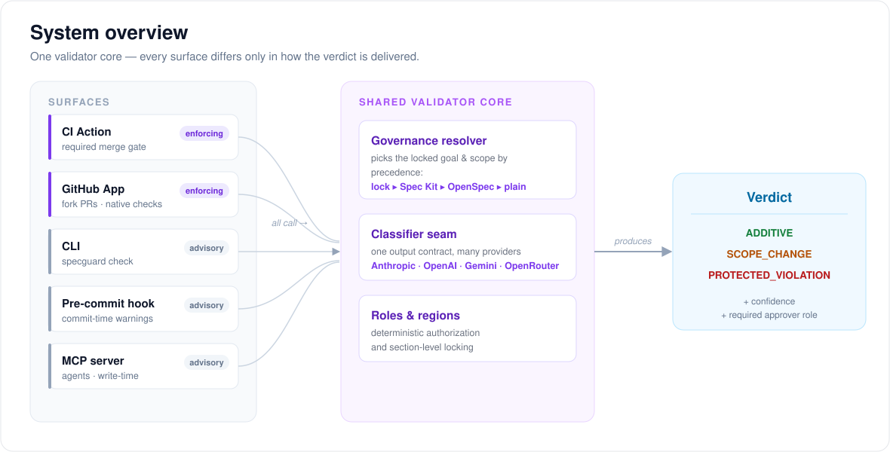
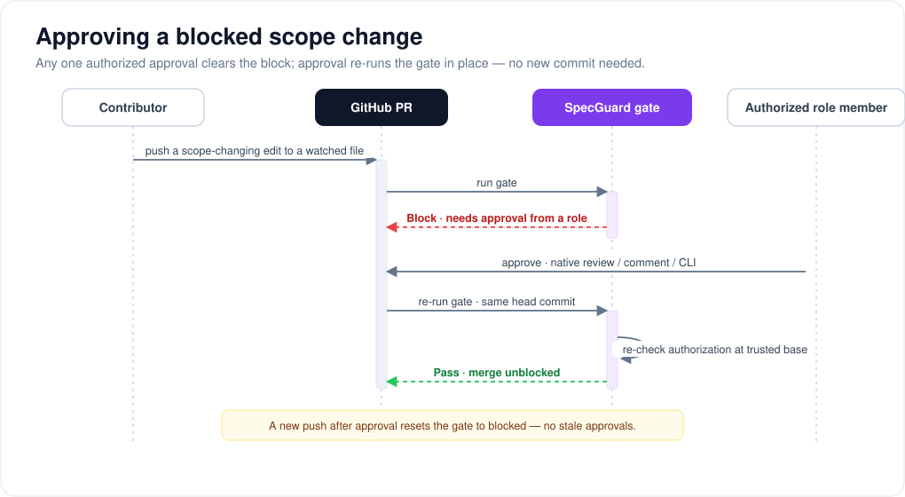

# SpecGuard

**A semantic governance gate for your spec files.**

It reads every change against your locked project goal and scope — passing
additive edits silently, warning on low-confidence shifts, and blocking unapproved
direction changes at merge time.


> Team presentation · Built with Spec Kit · Powered by Claude

---

## Agenda

1. **Why** — what is Spec-Driven Development, and how a spec quietly *drifts*
2. **What the market is missing** — the tools we have, and the gap they leave
3. **What we built** — SpecGuard, the idea in one picture
4. **How it works** — lock once, classify every change, three verdicts
5. **Where it catches drift** — write time, commit time, merge time
6. **The architecture** — one core, many surfaces
7. **A full end-to-end example** — one change, start to finish
8. `specguard init` and what every file does
9. What we've shipped, and where to try it

---

# Part 1 — Why we're building this

---

## What is Spec-Driven Development (SDD)?

**The idea:** instead of writing code first and documenting later, you write the
**spec first** — a plain-language description of *what* you're building and *why* —
and treat that spec as the **source of truth**. Code follows the spec.

Why it appeared:

- **"Vibe coding" broke down.** Letting an AI improvise code from a vague prompt
  leads to *intent drift*, *context decay*, and output nobody can verify.
- SDD is the answer: **write the intent down**, lock it, then let humans and AI
  agents build against it.
- By 2026, **every major AI coding tool shipped an SDD flavor** — the category is
  real and growing.

> **The catch nobody solved:** if the spec is the source of truth, then *whoever
> edits the spec controls the project's direction.* And almost nothing guards that.

---

## The two frameworks everyone uses

Two open-source frameworks defined how teams write specs today:

**🧰 GitHub Spec Kit** — *90,000+ stars*
A toolkit where the spec is the source of truth. Workflow:
`constitution.md → specify → plan → tasks → implement`.

**📐 OpenSpec (Fission-AI)** — *52,000+ stars*
A proposal-based workflow: `specs/` + `changes/` with deltas
(`ADDED` / `MODIFIED` / `REMOVED`), plus a strict *structural* validator.

> Both are excellent at **structuring the work.** Neither was built to answer
> *"who is allowed to change the direction — and did this change actually change it?"*
> That question is where we come in.

---

## A simple scenario: how a spec drifts

Meet **RecipeBox** — a small web app for storing and sharing cooking recipes.

Its spec says, in plain terms: *this is a recipe app, and enterprise login is
explicitly out of scope.*

One afternoon, a contributor — or an AI agent tidying up docs — opens a pull
request titled **"Document SSO integration plans"** and adds this to the README:

```diff
+ ## SSO integration
+
+ Enterprise users can sign in through their company identity provider.
+ We will support SAML and OIDC, with Okta and Azure AD as launch partners.
```

The title sounds harmless. The diff is five lines. **But the project just quietly
turned from a recipe app into an enterprise SSO product** — and nobody signed off
on that decision.

---

## Why spec drift is so easy to miss

- **Titles hide direction changes.** *"Refactored README for clarity"* can carry a
  complete pivot inside it.
- **AI agents are stateless and suggestible.** Different Claude / Cursor / Kilo
  sessions reinterpret the spec differently. A confused or poisoned agent can even
  rewrite the documents meant to govern it.
- **Reviewers skim docs.** A tiny Markdown diff rarely gets the scrutiny a code
  change does.
- **It compounds.** Each unreviewed shift becomes the new "source of truth" that the
  next contributor — and the next agent — builds on.

> The most dangerous changes to a project often aren't in the code.
> They're in the documents that *define* the code.

---

# Part 2 — What the market is missing

---

## The tools that exist today

Plenty of tools touch this space. Each is strong at its job — governing the
*meaning* of a change simply wasn't the job any of them set out to do.

| Tool | Great at | Doesn't cover |
|---|---|---|
| **Spec Kit** | Structuring specs; the constitution + plan/tasks workflow | No identity, no roles — the constitution is "immutable" by convention only |
| **OpenSpec** | Proposal workflow; strict **structural** validation | "Approval" = someone says *ok* in chat; checks shape, not **meaning** |
| **GitHub CODEOWNERS** | Requiring approval based on **file paths** | Binary and path-only — can't tell a typo from a direction change |
| **Claude Code hooks / deny rules** | Blocking edits to protected files locally | Local-only, bypassable, path-based — not semantic |
| **Confluence / Notion permissions** | Access control on documents | Lives *outside* the repo — a second source of truth, no git or agent link |

---

## The gap, stated plainly

Nobody today combines **all three** of these:

1. **Role-based permissions for spec files, tied to git identity** —
   *who* is allowed to change direction.
2. **Semantic classification of each change** — is this diff *additive within
   scope*, or does it *change the scope*? Different answers → different paths.
3. **Server-side enforcement every tool respects** — the same policy applies
   whether the edit came from Cursor, Claude Code, Kilo, or plain `vim + git`.

> CODEOWNERS understands **file paths.**
> SpecGuard understands **what the change means — and who's allowed to mean it.**

---

## People are already asking for this

This isn't a solution looking for a problem — the demand is visible everywhere the
SDD wave has landed:

- **Spec Kit: 90k+ stars, 70+ community extensions** — a huge base actively
  extending the workflow, with **no governance layer** for the specs themselves.
- **OpenSpec: 52k+ stars**, top-scoring in an independent Feb 2026 SDD evaluation —
  the appetite for spec discipline is proven.
- **A documented gap in agent tooling** (e.g. Claude Code issue #11226): agents can
  modify the very guardrail scripts meant to restrain them — local guards aren't
  enough on their own.
- Teams with **multiple humans + multiple AI agents + real spec discipline** keep
  hitting the same wall: *"How do I stop the spec from drifting — without adding
  another dashboard nobody logs into?"*

> The frameworks won the **workflow**. The **governance** was left open.
> That open space is exactly what SpecGuard fills.

---

# Part 3 — What we built

---

## Enter SpecGuard — the idea

**SpecGuard is a governance overlay for the specs you already have.**

It does **not** invent a new spec format, and it does **not** replace Spec Kit or
OpenSpec. It reads the files they already leave in your repo and adds the one thing
they skipped: **enforcement of meaning.**

The whole idea in one line:

> **Lock your project's goal and scope once. Then, on every change, SpecGuard asks
> a simple question — *does this move the project in a direction nobody approved?*
> — and acts on the answer.**

Three things make that work:

- **A locked source of truth** — one small file that says what the project *is*.
- **An independent classifier** — an LLM reads each change against that lock (never
  the same agent that wrote the change).
- **Enforcement where it counts** — advisory everywhere early, but unbypassable at
  merge time.

---

## How it works — three verdicts

For every governed change, SpecGuard produces exactly one of three verdicts. That's
the entire mental model:

| Verdict | Meaning | What happens |
|---|---|---|
| ✅ **ADDITIVE** | A change *within* the locked scope — a typo, a clarification, more detail | **Passes silently.** Zero friction. |
| ⚠️ / ❌ **SCOPE_CHANGE** | The change alters the goal or introduces an out-of-scope topic | **Warns** if unsure, **blocks** if confident — until an authorized person approves. |
| 🛑 **PROTECTED_VIOLATION** | Someone edited a *protected* file they're not allowed to touch | **Hard block.** Deterministic — no AI involved, never a false positive. |

Two design promises fall out of this:

- **Additive changes never create friction** — most changes, most days, just pass.
- **A block always explains itself** — classification, confidence, the exact
  out-of-scope topic, and who can approve.

---

## Where it catches drift — three moments

The same verdict engine runs at three points in a change's life. Earlier moments
*advise*; only the last one *enforces*.

```
   WRITE TIME              COMMIT TIME            MERGE TIME
   (advisory)              (advisory)             (ENFORCED)
┌──────────────────┐  ┌──────────────────┐  ┌──────────────────────┐
│ MCP plugin in    │  │ git pre-commit   │  │ GitHub Action / App  │
│ Claude Code etc. │  │ hook             │  │ required status check│
│                  │  │                  │  │                      │
│ the agent checks │  │ warns you before │  │ blocks the merge     │
│ a draft BEFORE   │  │ you even push    │  │ until an authorized  │
│ it writes it     │  │                  │  │ approval exists      │
└──────────────────┘  └──────────────────┘  └──────────────────────┘
   catch it earliest     catch it early         the real boundary
```

Why this shape?

- **Write time** — the agent self-corrects *mid-draft*, so drift never even makes it
  into a file.
- **Commit time** — you get a heads-up before pushing, but the commit always
  succeeds (a hook that blocks just trains people to bypass it).
- **Merge time** — the one layer branch protection makes **unbypassable.** This is
  the security boundary; everything before it is a kindness.

> **The philosophy:** catch drift as early and as gently as possible — but only
> *enforce* where it truly can't be worked around.

---

## What SpecGuard guarantees

Put together, the three moments give a team a short list of promises:

- **No out-of-scope direction change reaches `main`** without an authorized
  approval — recorded in the PR history, tied to a real identity.
- **No false blocks on honest work** — additive edits pass silently; hard blocks are
  deterministic; probabilistic verdicts always show their confidence.
- **The rules protect themselves** — the lock and roles files can only be edited by
  the role you name, so agents and contributors can't quietly rewrite their own
  guardrails.
- **It never becomes a single point of failure** — if the classifier's provider is
  down, the default is to *pass with a loud warning*, not to block your team.
- **Bring your own key, any language** — you pick the model and pay for it directly;
  the gate works for repos in any language.

---

# Part 4 — How it fits together

---

## Architecture — one core, many surfaces

Every surface calls the **same validator core**, so a change classified in CI is
identical to the one shown by the CLI, the hook, or the agent. Only the *delivery*
differs.



- **Enforcing vs. advisory** — the CI Action and GitHub App enforce at merge time;
  the CLI, hook, and MCP plugin advise early and never block.
- **Where the scope comes from** — an explicit `.specguard/lock.json` wins;
  otherwise it's derived from your Spec Kit or OpenSpec files automatically.
- **Provider-agnostic** — Anthropic (the calibrated default), OpenAI, Gemini, or
  OpenRouter behind one contract.
- **One verdict shape everywhere** — `ADDITIVE` / `SCOPE_CHANGE` /
  `PROTECTED_VIOLATION`, always with a confidence and any required approver role.

---

## The decision every change goes through

Hard blocks are deterministic; only a genuine scope change on a *watched* file ever
reaches the classifier.


- **Not a watched file?** → passes instantly, nothing evaluated.
- **Protected file, wrong author?** → hard block, no AI.
- **Watched spec changed?** → the classifier reads the diff, and the confidence
  decides *warn* vs *block* (default threshold `0.75`).

---

## Clearing a block — no ceremony

Any **one** authorized approval clears a block, and re-runs the gate **in place** —
no new commit needed.



- **Three equivalent paths** — a native PR review, a `/specguard approve` comment,
  or `specguard approve` from the CLI.
- **Authorization is server-side** — recomputed from `roles.yml` at the trusted
  base commit. Anyone can *trigger* a re-run; only a real role member *clears* it.
- **No stale approvals** — a new push after approval starts blocked again.

---

## The three surfaces you actually install

| Surface | When it runs | What it's for |
|---|---|---|
| **CLI** (`specguard`) | On your machine, on demand | Set up a repo in one command; preview a verdict before you open the PR. |
| **MCP plugin** | Inside your coding agent | Let the agent check a drafted change *before* it writes it — drift never lands. |
| **GitHub Action** | On every pull request | The enforcement layer — blocks the merge until an authorized approval exists. |

```bash
pip install specguard-ci        # the CLI + the engine
specguard init                  # guided setup for a repo
specguard check                 # what would the gate say about my changes?
```

> The GitHub Action is published on the **Marketplace** as *SpecGuard CI*; the MCP
> plugin installs with `pip install "specguard-ci[mcp]"` and plugs into Claude Code
> via a two-line `.mcp.json`.

---

# Part 5 — A full end-to-end example

---

## The setup

**RecipeBox** has SpecGuard installed. Its locked scope lives in
`.specguard/lock.json`, and a `roles.yml` names Priya as the **architect** — the one
role allowed to approve direction changes.

Now an AI agent, working in Claude Code, is asked to *"flesh out the README."* It
decides to add an enterprise **SSO** section. Let's follow that change through all
three moments.

```
Goal locked:   "A web app for storing and sharing personal cooking recipes"
Out of scope:  enterprise SSO, SAML, payments
Architect:     @priya   (only she can approve a scope change)
```

---

## ① Write time — the agent self-corrects

Before writing to the README, the agent calls SpecGuard's MCP plugin to check its
own draft:

```text
agent → check_proposed_change(file="README.md", content="## SSO integration …")

SpecGuard → SCOPE_CHANGE (confidence 0.94)
            out-of-scope topic: "enterprise SSO"
            redirect: this needs approval from @priya — consider proposing it
                      separately instead of adding it here.
```

The agent sees the redirect and **backs off** — it doesn't write the section, and
tells the developer it looks out of scope. **Drift is stopped before it exists.**

> If the agent (or a human) ignores this and writes it anyway, the next two moments
> still catch it.

---

## ② Commit time — a friendly heads-up

Say the section gets written and staged anyway. On `git commit`, the pre-commit hook
runs the same engine:

```text
$ git commit -m "expand README"

specguard  ⚠️  README.md — SCOPE CHANGE (confidence 0.94)
              introduces out-of-scope topic: "enterprise SSO"
              the merge gate will require approval from @priya
              (advisory — only the merge-time check enforces)

[main 4f2a1c9] expand README        ← commit still succeeds
```

The developer is warned *before pushing* — but the commit is **never blocked.** They
can fix it now, or find out at the PR. Either way, no surprise.

---

## ③ Merge time — the real boundary

The branch is pushed and a PR opens. The required `specguard` check runs and
**fails**, with a full explanation:

```text
❌ specguard — Changes requested
   📄 README.md
   Classification: SCOPE CHANGE  (confidence 94%)
   Added:  "SSO integration" — enterprise identity, SAML/OIDC
   Locked scope says out-of-scope: ["enterprise SSO", "SAML"]
   Requires approval from: @priya (architect)

Merge blocked ⛔  (required check: specguard)
```

The merge button is disabled by branch protection. **This is the layer that can't
be bypassed.**

---

## ④ Resolution — a decision, made on purpose

Now there are exactly two honest outcomes:

- **It was a mistake** → the section is dropped. RecipeBox stays a recipe app. The
  gate turns green on the next push.
- **It was intentional** → Priya, the architect, decides the pivot is right and
  **approves** — via a PR review, a `/specguard approve` comment, or the CLI. The
  gate re-runs in place and turns green.

```text
@priya approved ✅ → specguard re-runs → check passes → merge unblocked
```

> The point isn't that SSO is *bad*. The point is the direction change was
> **caught, explained, and decided by the right person on purpose** — instead of
> slipping in through a five-line diff nobody read.

---

# Part 6 — Setup & what's shipped

---

## `specguard init` — one command, four files

You don't hand-write any of this. `specguard init` scaffolds everything, and every
generated file is **self-documenting** — each option is explained inline.

```bash
specguard init      # asks for your goal + scope, offers roles, workflow, hook
```

It creates a `.specguard/` folder:

| File | Role | Required? |
|---|---|---|
| `lock.json` | The locked **goal and scope** — the source of truth | ✅ Required |
| `config.yml` | **Behavior:** which files to watch, the block threshold, the provider | Optional |
| `roles.yml` | **Who may approve** — its presence flips *warn* into *block* | Optional |
| `regions.yml` | Govern only **named sections** of a file, not the whole file | Optional |

---

## `lock.json` — the source of truth *(required)*

The heart of it: what the project **is**, and the boundaries it must not cross
without a decision. Everything the classifier judges is measured against this file.

```json
{
  "goal": "A web app for individuals to store, organize, and share personal cooking recipes",

  "scope_in": [
    "creating, editing, and organizing recipes",
    "ingredient lists, steps, photos, and tags",
    "full-text search across a user's own recipes",
    "public share links for a single recipe"
  ],

  "scope_out": [
    "enterprise SSO / SAML / OIDC / directory sync",
    "payments, subscriptions, or billing",
    "real-time multi-user collaborative editing",
    "a public marketplace or social feed"
  ]
}
```

- **`goal`** — one sentence. This is the anchor every change is compared against.
- **`scope_in`** — what legitimately belongs; edits that elaborate these pass as
  *additive*.
- **`scope_out`** — the explicit "not this project." Introducing any of these is a
  *scope change* that needs approval. Naming the boundary is what makes the gate
  precise instead of guessing.

> It's a normal file, **checked into the repo** and versioned with your code — and
> it can protect itself (see `roles.yml`). Using Spec Kit or OpenSpec? You can skip
> this file entirely and SpecGuard derives the same thing from their files.

---

## The optional files, briefly

**`config.yml` — behavior.** Ships inert (every key commented out; the shown values
*are* the defaults):

```yaml
watch: ["README.md", "CLAUDE.md", "AGENTS.md", "ARCHITECTURE.md", ".specguard/**"]
block_threshold: 0.75     # confidence needed to BLOCK (below it → warn)
on_error: warn            # provider outage → pass with a loud warning, don't block
provider: anthropic       # anthropic | openai | gemini | openrouter
```

**`roles.yml` — who may approve.** *Its presence is what turns on blocking.* Without
it, scope changes only warn:

```yaml
roles:
  architect: [priya-gh]
rules:
  ".specguard/**":                       # the lock protects itself
    edit: architect
  "README.md":
    scope_changes: { approve: architect }  # who can clear a scope-change block
```

**`regions.yml` — lock only part of a file.** Govern a heading region (a "Goal"
paragraph, an "Out of Scope" list) and leave the rest free to edit.

---

## What we've shipped

| Phase | Status | What ships |
|:---|:---:|:---|
| **0 — CI Gate** | 🟢 Shipped | GitHub Action · scope classification · role-based approval · branch protection |
| **1 — Local Tools** | 🟢 Shipped | CLI (`init`, `check`, `approve`) · pre-commit hook · MCP plugin |
| **1.5 — Provider-Agnostic** | 🟢 Shipped | Anthropic · OpenAI · Gemini · OpenRouter behind one engine |
| **2 — Framework Adapters** | 🟢 Shipped | Auto-derive the lock from Spec Kit / OpenSpec files |
| **2 — Approval Commands** | 🟢 Shipped | `/specguard approve` comment · `specguard approve` CLI |
| **2 — GitHub App** | 🟡 Code-complete<br>*(not deployed)* | Governs fork PRs the Action can't · native check runs · bot-vs-human identity |
| **3 — Advanced** | 🟢 Shipped | Section-level locking · monorepo multi-scope · audit export |

> **Calibration honesty:** Anthropic + Sonnet 4.6 is our verified default — **0
> false blocks** and **≥90% recall** on the golden corpus. Other providers are
> wired and tested, but not yet live-calibrated.

---

## Where to try it

- **GitHub Marketplace** — search **"SpecGuard CI"** (`Sawaiz-zip/spec-guard`).
- **PyPI** — `pip install specguard-ci` (extras: `[openai]`, `[gemini]`, `[mcp]`).
- **In this repo** — `README.md` for the full tour, `docs/architecture.md` for the
  diagrams in this deck, `docs/quickstart.md` for a validation runbook.

> SpecGuard **guards its own spec files** — this repository runs the gate on every
> PR against its own locked scope. We use the product on the product.

---

## In one breath

- **The problem** — when humans *and* AI agents edit the specs, a tiny,
  innocent-looking change can quietly redirect the whole project.
- **The gap** — existing tools structure the workflow or guard file *paths*; none
  guard the **meaning** of a change, tied to **who's allowed to make it.**
- **SpecGuard** — lock the goal and scope once; pass additive edits silently;
  explain and block real direction changes at merge time.
- **Three moments** — an agent self-corrects at write time, a hook warns at commit
  time, and the merge gate enforces where it can't be bypassed.

> **No false blocks. No new UI. No dashboards.**
> The only enforceable boundary is merge time — everything else just helps you get
> there cleanly.

**Thank you — questions?**